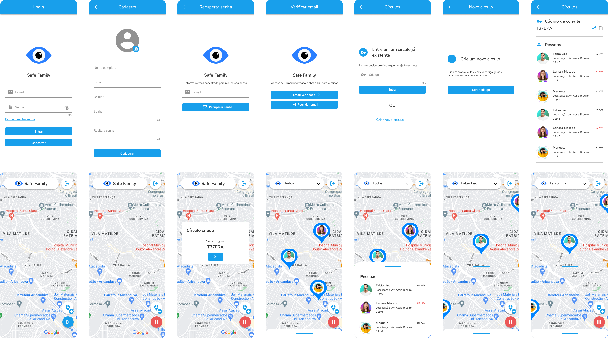

# Safe Family

If you want to take a look on Figma project, [its here](https://www.figma.com/file/FLc3tQNBqNZZVnOBQHSg66/Safe-Family?type=design&node-id=207%3A587&mode=design&t=k1ChMWtF5n4ZP8G6-1).

## About this Project

The idea of the App is:

"Sharing location and device information in real-time between circle members."

## Why?

This project was developed just to compose the portfolio and I'm glad for any feedbacks that help me to be a better developer.

Email-me: [giovanelopes@id.uff.br](mailto:giovanelopes@id.uff.br)

LinkedIn: [Giovane Lopes - Linkedin](https://www.linkedin.com/in/giovane-lopes-da-silva-1228b3167/)

## Technologies Used

- Flutter
- Dart
- Cubit
- Modular
- Firebase
- Clean Dart

## Installation and Usage
To install and use the project, follow these steps:

- Make sure you have the Flutter SDK installed on your development environment.

- Clone this repository to your local environment.

`git clone https://github.com/GiovaneLopes/safe_family.git`

- Navigate to the project directory.

`cd safe_family`

- Run the command to fetch the necessary dependencies.

`flutter pub get`

- Start the application on an emulator or connected device.

`flutter run`

- Make sure the emulator or connected device has internet acess.